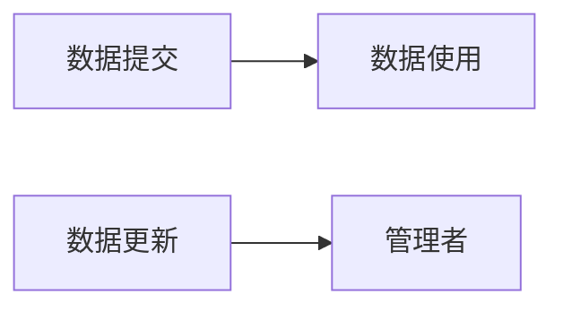

# 设计文档


## 1. 博物馆网站数据采集系统设计文档

### 1.1 引言

#### 1.1.1 系统概述

博物馆数据库采集系统将实现国家一级博物馆官网的部分内容的数据爬取，数据加工，数据上传以及数据更新的功能。

#### 1.1.2 文档概述

本文档描述了博物馆数据库采集系统的详细设计。

- 阅读人群：开发人员，项目管理人员，测试人员。

#### 1.1.3 基线

实现有官网的国家一级博物馆的名称，介绍，藏品及活动的数据爬取，数据加工，数据上传以及数据更新的功能。

### 1.2 引用资料

《GB-T+8567-2006计算机软件文档编制规范》

### 1.3 系统设计概述

该系统按照功能划分为客户端子系统和管理端子系统，数据采集管理人员管理数据的获取与加工，用户（后台数据库管理人员）从系统申请查看数据或更新数据。

### 1.4 系统体系结构设计

#### 1.4.1 体系结构

##### 1.4.1.1 程序模块划分

| 名称     | 功能                         |
| -------- | ---------------------------- |
| 数据爬取 | 爬取所有博物馆需要采集的数据 |
| 数据加工 | 筛选所需要的数据             |
| 数据存储 | 存储加工后的数据             |
| 数据提交 | 将加工好的数据提供给用户     |
| 数据更新 | 获得用户请求，更新数据       |

##### 1.4.1.2 程序层次结构关系

 管理者


使用者



#### 1.4.2 全局数据结构说明

本章说明本程序系统中使用的全局数据常量、变量和数据结构

##### 1.4.2.1 常量

项目名称，文件目录，配置项，接口

##### 1.4.2.2 全局变量

无

##### 1.4.2.3 数据结构

文件结构

```
MuseumDataCollectSubsystem             # 项目文件夹
| 
| -- README.md                         # 用户文档
| -- M_ID.csv                          # 博物馆网站编号
| -- requirements.txt                  # python第三方库
| -- submit.py                         # 向数据库提交数据的代码
| -- update.py                         # 定时更新脚本
| -- museum_spider                     # 博物馆爬虫文件夹
|    | -- src                          # 源代码文件夹
|    |    | -- configuration.py        # 配置文件
|    |    | -- includes.py             # 头文件
|    |    | -- main.py                 # 主程序 
|    |    | -- museums                 # 博物馆源代码文件 
|    |    |    | -- M<museum id>.py    # 博物馆爬虫文件。例 M100101.py 
|    |    |    | -- ...
|    |
|    | -- museums                      # 爬取博物馆结果文件夹
|    |    | -- M<museum id>.json       # 爬取博物馆结果字典
|    |    | -- ...
|    |
|    | -- collections                  # 爬取藏品文件夹
|    |    | -- C<collection id>.json   # 爬取藏品结果字典
|    |    | -- ...
|    |
|    | -- activities                   # 爬取活动文件夹
|    |    | -- A<activtiy id>.json     # 活动字典
|    |    | -- ...
|    |

```


### 1.5  接口设计

| 接口名称     | 对象         | 功能               |
| ------------ | ------------ | ------------------ |
| 数据提交接口 | 数据库管理员 | 返回提交的数据字典 |
| 更新接口     | 数据库管理员 | 执行数据更新的服务 |

### 1.6 环境

- 本系统的硬件环境如下：
  - 客户机：普通PC
    - CPU：P4 1.8GHz以上
    - 内存：256MB以上
    - 能够运行IE5.0以上或者Netscape4.0以上版本的机器
    - 分辨率：推荐使用1024*768像素

- 本系统的的软件环境如下：
  - 操作系统：Unix/Linux/windows2000或以上版本
  - 数据库：SQL Server 2000
  - 开发环境：python
  - Web服务器：Tomcat
  - 浏览器：Edge, IE6.0以上，
  
- 主机安装说明:

  1. 安装python3,安装第三方库
     `pip install -r requirements.txt`
     `requirements.txt`
     
     ```
     # 爬虫相关
     requests==2.22.0
     bs4==4.8
     requests_html==0.10.0
     
     selenium==3.141.0
     
     # 更新
     importlib
     psutil
     sched
     
     # 数据库
     pymysql
     ```
     
     
     
  2. 安装Egde浏览器，安装对应版本EdgeDriver [Microsoft Edge Driver - Microsoft Edge Developer](https://developer.microsoft.com/en-us/microsoft-edge/tools/webdriver/)

  3. 运行`update.py`文件
